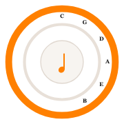

# Circle of Fifths — Chord Charts

An interactive music theory app for piano, optimised for iPad. Built as a Progressive Web App (PWA) — install it on your iPad home screen for a native app experience.



## Features

### 🎹 Chord Charts
- All 12 major and 12 minor keys
- Triads with Root, 1st and 2nd inversions + Sus2 / Sus4
- Major 7, Dominant 7, Diminished 7 (all 4 inversions)
- Minor 7, m7♭5, Diminished 7 for minor keys
- Piano keyboard diagrams with highlighted notes and note names

### 🎼 Scales
- **Major keys:** Major Scale, Major Pentatonic, Major Blues
- **Minor keys:** Natural Minor, Harmonic Minor, Melodic Minor (Asc/Desc), Minor Pentatonic, Minor Blues
- One octave shown centrally on keyboard

### 🎶 Modes
All 7 modes derived from each key's major scale:
Ionian · Dorian · Phrygian · Lydian · Mixolydian · Aeolian · Locrian
Each with colour coding, feel description, song examples and AI exploration

### 🤖 AI Teaching Tools
- **AI Tab** per key: Chord Progressions, Harmonic Relationships analyser, Practice Path, Key Relationships
- **Key Quiz** — intermediate-level questions on modal theory and key relationships
- **Song Decoder** — identify key and chords from any song title
- **Daily Challenge** — personalised practice focus

### 🔁 Navigation
- Relative key button (jump between major/minor relatives)
- Circle of Fifths mini-icon back button on all pages
- Persistent navigation (remembers your last page on refresh)

---

## Installing on iPad

1. Open **Safari** on your iPad
2. Navigate to the GitHub Pages URL (see below)
3. Tap the **Share** button (box with arrow)
4. Tap **"Add to Home Screen"**
5. Tap **Add** — the app icon appears on your home screen
6. Open the app — it works fully offline once loaded

---

## GitHub Pages Deployment

1. Fork or clone this repository
2. Go to **Settings → Pages**
3. Set source to **main branch, root folder**
4. Your app will be live at:
   `https://[your-username].github.io/[repo-name]/`

---

## File Structure

```
├── index.html                  # Entry point + PWA splash screen
├── Circle Of Fifths App.html   # Main app
├── ai-features.jsx             # AI teaching components
├── manifest.json               # PWA manifest
├── sw.js                       # Service worker (offline support)
├── icon.svg                    # Vector icon
├── icon-180.png                # Apple touch icon
├── icon-192.png                # PWA icon
├── icon-512.png                # PWA icon (large)
└── README.md
```

---

## Technology

- **React 18** (via CDN, no build step required)
- **Babel Standalone** for JSX transpilation
- **Service Worker** for full offline support
- **Claude AI** (Haiku) for AI teaching features
- Pure HTML/CSS/JS — no framework, no npm, no build tools

---

## AI Features Note

The AI features use the Claude API built into the hosting environment. When deployed to GitHub Pages, AI calls will require network access. All chord, scale, and mode data works fully offline.

---

## Credits

Chord data and layout derived from *Piano Chords App Files* reference material.
Built with ♩ using React + Claude AI.
